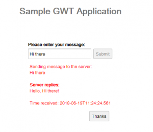

## Google Web Toolkit

# 1. Introdução
GWT ou Google Web Toolkit é uma estrutura para a construção de aplicativos da web de alto desempenho em Java.

Neste tutorial, vamos nos concentrar e cobrir alguns de seus principais recursos e funcionalidades.

# 2. GWT SDK
O SDK contém as bibliotecas Java API, um compilador e um servidor de desenvolvimento.

### 2.1. API Java
A API GWT possui classes para construção de interfaces de usuário, realização de chamadas ao servidor, internacionalização, realização de testes unitários. 

### 2.2. Compilador
Simplificando, o compilador GWT é um tradutor de código-fonte do código Java para o Javascript. O resultado da compilação é um aplicativo Javascript.

A lógica de seu trabalho inclui a eliminação de classes, métodos e campos não utilizados do código e a redução de nomes Javascript.

Por causa dessa vantagem, não precisamos mais incluir bibliotecas Ajax em nosso projeto Javascript. Claro, também é possível definir dicas durante a compilação do código.

Aqui estão alguns parâmetros úteis do GWTCompiler:

- logLevel - para definir um dos níveis de registro ERROR, WARN, INFO, TRACE, DEBUG, SPAM, ALL;
- workdir - diretório de trabalho do compilador;
- gen - o diretório para gravar os arquivos gerados;
- out - o diretório dos arquivos de saída;
- otimizar - Define o nível de otimização do compilador de 0 a 9;
- style - o estilo de saída do script OBF, BONITO ou DETALHADO;
- módulo[s] - o nome dos módulos a compilar.

# 3. Configuração
O SDK mais recente está disponível na página de download. O resto da configuração está disponível na página de introdução.

### 3.1. Maven

Para configurar o projeto com Maven, precisamos adicionar as seguintes dependências a pom.xml:

```
<dependency>
    <groupId>com.google.gwt</groupId>
    <artifactId>gwt-servlet</artifactId>
    <scope>runtime</scope>
</dependency>
<dependency>
    <groupId>com.google.gwt</groupId>
    <artifactId>gwt-user</artifactId>
    <scope>provided</scope>
</dependency>
<dependency>
    <groupId>com.google.gwt</groupId>
    <artifactId>gwt-dev</artifactId>
    <scope>provided</scope>
</dependency>
```

A biblioteca gwt-servlet oferece suporte aos componentes do lado do servidor para invocar um ponto de extremidade GWT-RPC. gwt-user contém a API Java que usaremos para construir nosso aplicativo da web. gwt-dev possui o código para compilador, implantação ou hospedagem do aplicativo.

Para garantir que todas as dependências usem a mesma versão, precisamos incluir a dependência GWT pai:

```
<dependency>
    <groupId>com.google.gwt</groupId>
    <artifactId>gwt</artifactId>
    <version>2.8.2</version>
    <type>pom</type>
    <scope>import</scope>
</dependency>
```

Todos os artefatos estão disponíveis para download no Maven Central.

# 4. Aplicação
Vamos construir um aplicativo da web simples. Ele enviará uma mensagem ao servidor e exibirá a resposta.

Em geral, um aplicativo GWT consiste nas partes do servidor e do cliente. O lado do cliente faz uma solicitação HTTP para se conectar ao servidor. Para tornar isso possível, o GWT usa Remote Procedure Call ou simplesmente mecanismo RPC.

# 5. GWT e RPC
Voltando ao nosso aplicativo, vamos ver como a comunicação RPC é feita. Para isso, criamos um serviço para receber uma mensagem do servidor.

Vamos primeiro criar uma interface:

```
@RemoteServiceRelativePath("greet")
public interface MessageService extends RemoteService {
    String sendMessage(String message) throws IllegalArgumentException;
}
```

A anotação @RemoteServiceRelativePath mapeia o serviço para a URL relativa do módulo / mensagem. MessageService deve se estender da interface do marcador RemoteService para realizar a comunicação RPC.

A implementação de MessageService está no lado do servidor:

```
public class MessageServiceImpl extends RemoteServiceServlet 
  implements MessageService {

    public String sendMessage(String message) 
      throws IllegalArgumentException {
        if (message == null) {
            throw new IllegalArgumentException("message is null");
        }

        return "Hello, " + message + "!<br><br> Time received: " 
          + LocalDateTime.now();
    }
}
```

Nossa classe de servidor se estende da classe de servlet base RemoteServiceServlet. Ele desserializará automaticamente as solicitações de entrada do cliente e serializará as respostas de saída do servidor.

Agora vamos ver como o usamos do lado do cliente. O MessageService é apenas uma versão definitiva do nosso serviço.

Para atuar no lado do cliente, precisamos criar a versão assíncrona do nosso serviço:

```
public interface MessageServiceAsync {
    void sendMessage(String input, AsyncCallback<String> callback) 
      throws IllegalArgumentException;
}
```

Aqui podemos ver um argumento extra no método getMessage (). Precisamos assíncronos para notificar a IU quando a chamada assíncrona for concluída. Dessa forma, evitamos bloquear o thread da IU em funcionamento.

# 6. Componentes e seu ciclo de vida
O SDK oferece alguns elementos de interface do usuário e layouts para projetar as interfaces gráficas.

Em geral, todos os componentes da IU se estendem da classe Widget. Visualmente, temos os widgets de elemento que podemos ver, clicar ou mover na tela:

- widgets de componentes - TextBox, TextArea, Button, RadioButton, CheckBox, etc ...
e há widgets de layout ou painel que compõem e organizam a tela:
- widgets de painel - HorizontalPanel, VerticalPanel, PopupPanel, TabPanel, etc ...
Cada vez que adicionamos um widget ou qualquer outro componente ao código, o GWT trabalha muito para vincular o elemento de visualização ao DOM do navegador.

O construtor sempre inicializa o elemento DOM raiz. Quando anexamos um widget filho a um componente pai, ele também causa vinculação no nível do DOM. A classe do ponto de entrada contém a função de carregamento que será chamada primeiro. É aqui que definimos nossos widgets.

# 7. Ponto de entrada
Vamos dar uma olhada no principal ponto de entrada do aplicativo:

```
public class Google_web_toolkit implements EntryPoint {

    private MessageServiceAsync messageServiceAsync = GWT.create(MessageService.class);

    public void onModuleLoad() {
        Button sendButton = new Button("Submit");
        TextBox nameField = new TextBox();
        nameField.setText("Hi there");

        sendButton.addStyleName("sendButton");

        RootPanel.get("nameFieldContainer").add(nameField);
        RootPanel.get("sendButtonContainer").add(sendButton);
    }
}
```

Cada classe de IU implementa a interface com.google.gwt.core.client.EntryPoint para marcá-la como uma entrada principal para o módulo. Ele se conecta ao documento HTML correspondente, onde o código java é executado.

Podemos definir os componentes da IU do GWT e atribuí-los a tags HTML com o mesmo ID fornecido. A classe do ponto de entrada substitui o método do ponto de entrada onModuleLoad(), que é chamado automaticamente ao carregar o módulo.

Aqui, criamos os componentes da IU, registramos manipuladores de eventos e modificamos o DOM do navegador.

Agora, vamos ver como criamos nossa instância de servidor remoto. Para isso, usamos o método estático GWT.create (MessageService.class).

Ele determina o tipo solicitado em tempo de compilação. Vendo este método, o compilador GWT gera muitas versões de código em tempo de compilação, apenas uma das quais precisa ser carregada por um cliente específico durante a inicialização em tempo de execução. Esse recurso é amplamente usado em chamadas RPC.

Aqui também definimos os widgets Button e TextBox. Para adicioná-los à árvore DOM, usamos a classe RootPanel. É o painel raiz e retorna um valor singleton para vincular os elementos do widget:

```
RootPanel.get("sendButtonContainer").add(sendButton);
```

Primeiro, ele obtém o contêiner raiz marcado com o id sendButtonContainer. Depois de anexar o sendButton ao contêiner.

# 8. HTML

Dentro da pasta /webapp, temos o arquivo Google_web_toolkit.html.

Podemos marcar os elementos da tag com os ids específicos para que a estrutura possa vinculá-los a objetos Java:

```
<body>
    <h1>Sample GWT Application</h1>
    <table align="center">
        <tr>
            <td colspan="2" style="font-weight:bold;">Please enter your message:</td>
        </tr>
        <tr>
            <td id="nameFieldContainer"></td>
            <td id="sendButtonContainer"></td>
        </tr>
    </table>
</body>
```

As tags <td> com os ids nameFieldContainer e sendButtonContainer serão mapeadas para os componentes Button e TextBox.

# 9. Descritor do Módulo Principal
Vamos dar uma olhada na configuração típica do arquivo descritor do módulo principal Google_web_toolkit.gwt.xml:

```
<module rename-to='google_web_toolkit'>
    <inherits name='com.google.gwt.user.User'/>
    <inherits name='com.google.gwt.user.theme.clean.Clean'/>
    <entry-point class='com.isaccanedo.client.Google_web_toolkit'/>
</module>
```

Tornamos as coisas principais do GWT acessíveis incluindo a interface com.google.gwt.user.User. Além disso, podemos escolher uma folha de estilo padrão para nosso aplicativo. Nesse caso, é * .clean.Clean.

As outras opções de estilo disponíveis são * .dark.Dark, * .standard.Standard, * .chrome.Chrome. O com.isaccanedo.client.Google_web_toolkit também é marcado aqui com a tag <entry-point />.

# 10. Adicionando manipuladores de eventos
Para gerenciar os eventos de digitação do mouse ou teclado, o GWT usará alguns manipuladores. Todos eles se estendem da interface EventHandler e têm um método com o argumento do tipo de evento.

Em nosso exemplo, registramos o manipulador de eventos de clique do mouse.

Isso irá disparar o método onClick() sempre que o botão for pressionado:

```
closeButton.addClickHandler(new ClickHandler() {
    public void onClick(ClickEvent event) {
        vPanel.hide();
        sendButton.setEnabled(true);
        sendButton.setFocus(true);
    }
});
```

Aqui podemos modificar o estado e o comportamento do widget. Em nosso exemplo, ocultamos o vPanel e ativamos o sendButton.

A outra maneira é definir uma classe interna e implementar as interfaces necessárias:

```
class MyHandler implements ClickHandler, KeyUpHandler {

    public void onClick(ClickEvent event) {
        // send message to the server
    }

    public void onKeyUp(KeyUpEvent event) {
        if (event.getNativeKeyCode() == KeyCodes.KEY_ENTER) {
            // send message to the server
        }
    }
}
```

Além do ClickHandler, também incluímos aqui a interface KeyUpHandler para capturar os eventos de pressionamento de tecla. Aqui, dentro do método onKeyUp(), podemos usar o KeyUpEvent para verificar se o usuário pressionou a tecla Enter.

E aqui como usamos a classe MyHandler para registrar os dois manipuladores de eventos:

```
MyHandler handler = new MyHandler();
sendButton.addClickHandler(handler);
nameField.addKeyUpHandler(handler);
```

# 11. Chamando o servidor
Agora, estamos prontos para enviar a mensagem ao servidor. Realizaremos uma chamada de procedimento remoto com o método sendMessage() assíncrono.

O segundo parâmetro do método é a interface AsyncCallback <String>, onde String é o tipo de retorno do método síncrono correspondente:

```
messageServiceAsync.sendMessage(textToServer, new AsyncCallback<String>() {
    public void onFailure(Throwable caught) {
        serverResponseLabel.addStyleName("serverResponseLabelError");
        serverResponseLabel.setHTML("server error occurred");
        closeButton.setFocus(true);
    }

    public void onSuccess(String result) {
        serverResponseLabel.setHTML(result);
        vPanel.setVisible(true);
    }
});
```

Como podemos ver, o receptor implementa o método onSuccess (String result) e onFailure (Throwable) para cada tipo de resposta.

Dependendo do resultado da resposta, definimos uma mensagem de erro “ocorreu um erro de servidor” ou exibimos o valor do resultado no contêiner.

# 12. Estilo CSS
Ao criar o projeto com o plug-in eclipse, ele irá gerar automaticamente o arquivo Google_web_toolkit.css no diretório /webapp e vinculá-lo ao arquivo HTML principal.

```
<link type="text/css" rel="stylesheet" href="Google_web_toolkit.css">
```

Claro, podemos definir estilos personalizados para os componentes de IU específicos de forma programática:

```
sendButton.addStyleName("sendButton");
```

Aqui, atribuímos um estilo CSS com o nome de classe sendButton ao nosso componente sendButton:

```
.sendButton {
    display: block;
    font-size: 16pt;
}
```

# 13. Resultado
Como resultado, temos este aplicativo da web simples:



Aqui, enviamos uma mensagem “Olá” para o servidor e imprimimos a mensagem “Olá, Olá!” resposta na tela.

# 14. Conclusão
Neste artigo rápido, aprendemos sobre os fundamentos do GWT Framework. Posteriormente, discutimos a arquitetura, ciclo de vida, recursos e diferentes componentes de seu SDK.

Como resultado, aprendemos como criar um aplicativo da web simples.